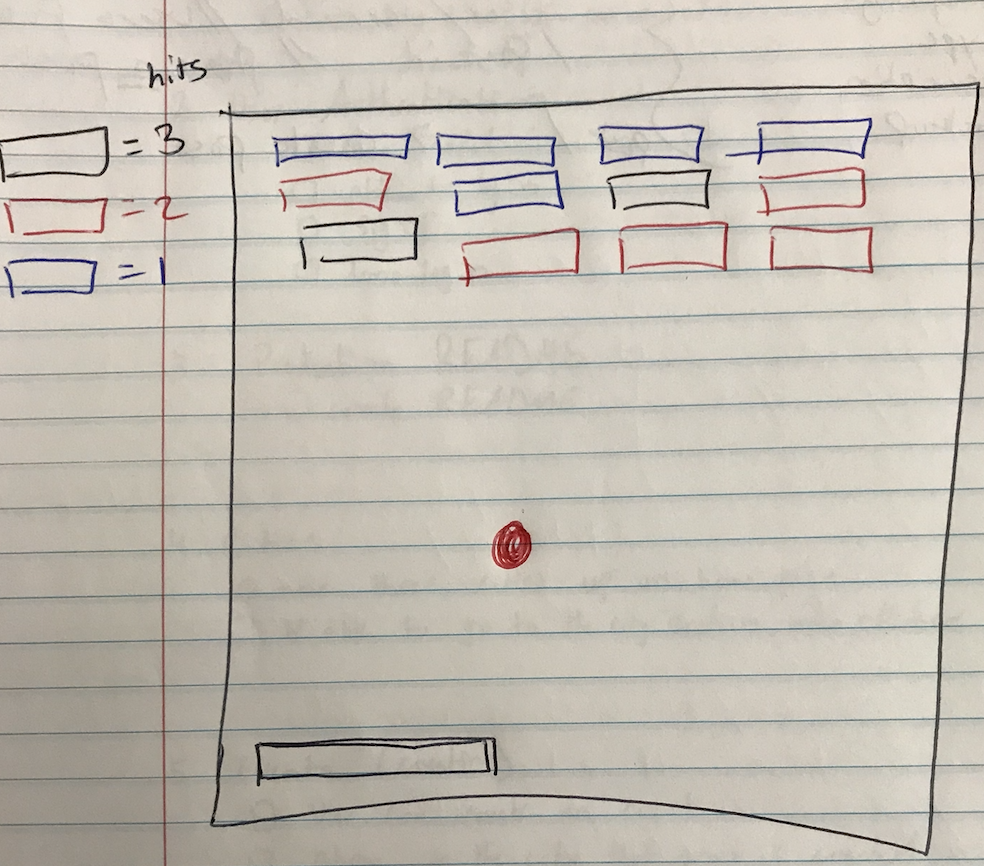

# Breakout
Breakout is a clone of the Atari Breakout. This game is played with your computer keyboard. The player is to controls the paddle moving left and right not letting the ball touch the bottom. The goal is to clear out the layers of bricks. When the ball hits the bricks, the bricks get demolish.  

## First Week Goals
This project was a one week project and the initial goals were listed below.

## Functionality and MVP:

1. Create a basic view with the bar, the ball, and the bricks with the same value
2. Have ball move in random motion and when it touches a brick it deletes it
3. Add sound on collisions
4. Add a start and restart function
5. Create more bricks with different/random values

## Architecture and Technologies

* JavaScript
    * Overall structure and game logic
* HTML5 Canvas
    * For DOM manipulation and rendering
* Web Audio Api
    * For sound generation
* Webpack
    * Bundle and serve various scripts

For Webpack entry file there will be three scripts that the project will consist of:
* platform.js 
    * Handle the logic for creating and updating the necessary DOM elements.
* breakout.js
    * Handle the physical logic of the game 
* audio.js
    * handle the audio logic 

## Wireframe

## Implementation Timeline

* Day 1
    * Review the procedures 
    * Get canvas rendering 
    * Set up the the paddle and bricks
* Day 2
    * Create the ball and have it move in motion
    * Have the ball bounce from: walls, bricks, and paddle
    * Game ends if ball touches the bottom
* Day 3
    * Dedicate this day to learn howlerjs
    * Get sounds to play when collisions
    * Get collisions graphics working
* Day 4
    * Create a start and restart function
    * Have a functional screen on the Canvas frontend that correctly handles running of the simulation.
* Day 5
    * Create bricks with different values
    * Have a styled Canvas
* Day 6 
    * Test for bugs
    *  Deploy the project

